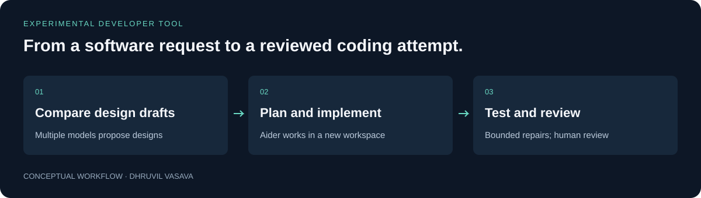

# Zoro Orchestrator

**From a software request to a reviewed coding attempt.**

An experimental pipeline that coordinates AI models to plan an application, ask a coding tool to implement it, and use test feedback for bounded repair attempts.

For exploring how planning, implementation, and feedback can be connected in an AI-assisted development workflow.



[Quick start](#try-it-locally) · [Technical guide](docs/TECHNICAL_GUIDE.md) · [Checks](https://github.com/Dhruvil151/zoro-orchestrator/actions) · [Portfolio](https://github.com/Dhruvil151)

## A simple example

Given a request for a small TODO API, the pipeline proposes an architecture, creates tasks, invokes Aider, and runs the generated test container. Failed tasks get a limited repair loop before manual review is needed.

[Follow a bounded TODO API walkthrough](examples/README.md), including which artifacts to inspect and how to independently validate the result. This is a reproducible procedure, not a completed live demo.

## What it does

- Requires a quorum of successful architecture proposals.
- Combines proposals into a plan and implementation tasks.
- Creates a separate workspace for each run.
- Stops after bounded repair attempts and saves run artifacts.

## Try it locally

```sh
npm ci
npm test
```

The offline suite requires no provider credentials. For a live run, install Node.js 22 or 24, Docker, Python, and Aider; configure your own provider credentials and models as described in the technical guide.

## How it is built

**Node.js · JavaScript · Groq · Gemini · Aider · Docker · Jest**

Failures are explicit: empty plans are rejected, repair attempts are bounded, and missing tests are not replaced with placeholder successes. The aim is an inspectable workflow, not an unsupported claim of autonomous correctness.

See the [technical guide](docs/TECHNICAL_GUIDE.md) for setup details, architecture, and implementation boundaries.

## Engineering decisions

### Require usable plans

Architecture proposals need a quorum and empty task plans are rejected. A missing provider response must not silently become a successful implementation.

### Bound repair work

Failed coding tasks enter a limited repair loop and escalate when that budget is exhausted. The workflow stops rather than consuming resources indefinitely; passing generated tests still requires independent review.

### Isolate run artifacts

Each run gets its own workspace and saves requirements, architecture, task plans, and a log. Reviewers can trace a result to its inputs. Workspace separation is not a sandbox for untrusted generated code.

## Checks and evidence

```sh
npm test
```

Live runs call external services and execute generated code. Use an isolated development environment and inspect outputs. Docker builds are not a security boundary for arbitrary generated instructions.

The [publication validation report](VALIDATION.md) records earlier checks and their limits. GitHub Actions records checks for subsequent commits.

## Current scope

Local prototype. Offline orchestration tests mock providers, Aider, and Docker. A complete live generation run has not been verified in the published validation report.


## License

Original project code and documentation are available under the [MIT License](LICENSE). Third-party dependencies and assets retain their own licenses; see [third-party notices](THIRD_PARTY_NOTICES.md).
